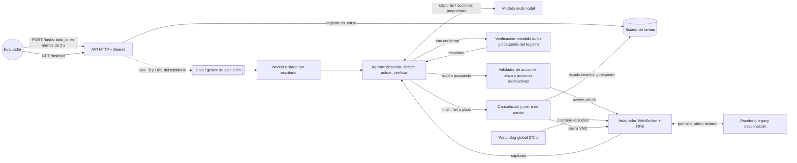

# agent screen — Arquitectura

```mermaid
flowchart LR
    evaluador(("Evaluador")) -- "POST /tasks: task_id en menos de 2 s" --> api["API HTTP + Bearer"]
    evaluador -- "GET /tasks/id" --> api
    api -- "registra en_curso" --> store[("Estado de tareas")]
    api -.-> |"task_id y URL del escritorio"| queue[["Cola / gestor de ejecución"]]
    queue -.-> worker["Worker aislado por escritorio"]
    worker --> agent["Agente: observar, decidir, actuar, verificar"]
    agent <-- "capturas / acciones propuestas" --> llm["Modelo multimodal"]
    agent -- "acción propuesta" --> guard["Validador de acciones, plazo y acciones destructivas"]
    guard -- "acción válida" --> vnc["Adaptador WebSocket + RFB"]
    vnc <-- "pantalla, ratón, teclado" --> desk["Escritorio legacy desconocido"]
    vnc -- "capturas" --> agent
    agent -- "tras confirmar" --> verify["Verificación: estabilización y búsqueda del registro"]
    verify -- "resultado" --> agent
    watchdog["Watchdog global 270 s"] -- "destruye el socket" --> vnc
    agent -- "finish, fail o plazo" --> stop["Cancelación y cierre de sesión"]
    stop -- "cierra VNC" --> vnc
    stop -- "estado terminal y resumen" --> store
```
